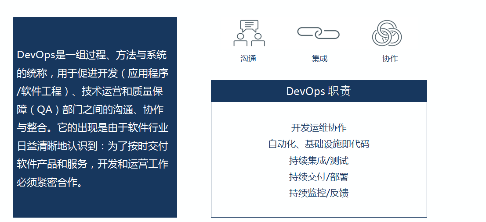

# DevOps基本概述

当前DevOps概念的深入人心，离不开云计算、容器/Docker、微服务、敏捷等相关概念和实施的成熟发展

DevOps（Development和Operations的组合词）是一组过程、方法与系统的统称，用于促进开发（应用程序/软件工程）、技术运营和质量保障（QA）部门之间的沟通、协作与整合。

- 狭义上讲：DevOps是提倡开发和IT运维之间的高度协同，从而在完成高频率部署的同时，提高生产环境的可靠性、稳定性、弹性和安全性。

- 广义上讲：

